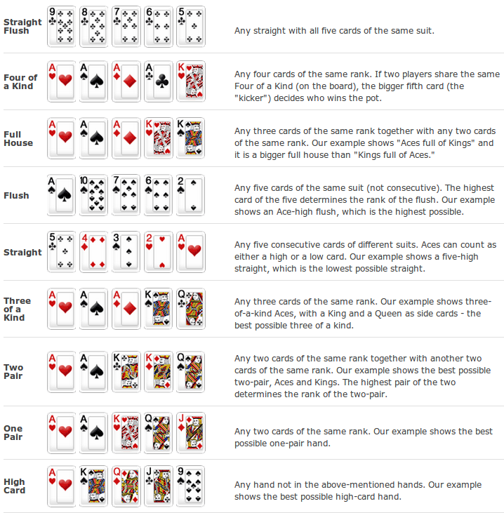

This is a basic skeleton for the [poker kata](http://codingdojo.org/cgi-bin/wiki.pl?KataTexasHoldEm). You can code it in javascript of coffeescript.

# The Goal

- Pairing
- Test driving (test/code/refactor)

# The Development Cycle

- Write a test in `spec/poker_spec.coffee`
- Write your code to make it pass in `src/poker.coffee` 
- Refactor to make it pretty
- Consider a commit
- Go back to #1

You can run the tests by running the script `run-tests`.

If you want to use javascript instead of coffeescript, just rename `spec/poker_spec.coffee` and `src/poker.coffee` to have the `js` extension.

# Install
You will need `node`, `npm` and `grunt-cli`. Once you have those, run `npm install` and make sure you can run the tests successfully by running `./run-tests`.

# The Kata

Given a list of poker hands, figure out what they are worth and figure out the winner.

See [original kata](http://codingdojo.org/cgi-bin/wiki.pl?KataTexasHoldEm).

The kata definition here was modified to only have poker hands with 5 cards. The input/output example was also simplified.

## Example Input / Output

Given this:

    Kc 9s Ks Kd 9d
    8c Ah Qs Qd 8d
    Ac Qc Js Jd 7d
    9h 5s 7c Qh 4h
    4d 2d 3d Ad Td
    7s Ts 6s 6d 9c

Your program should output this:

    Kc 9s Ks Kd 9d Full House (winner)
    8c Ah Qs Qd 8d Two Pair
    Ac Qc Js Jd 7d Pair
    9h 5s 7c Qh 4h High Card
    4d 2d 3d Ad Td Flush
    7s Ts 6s 6d 9c Pair

One test was already provided to test for this example input/output. You should write more tests to test lower-level details and edge cases.

If you have time, make sure your code:

- orders hands in descending value
- takes into account kickers
- handles an arbitrary number of hands
- calls out draws

# Kata Notes
As you implement the kata, pay attention to potential refactorings. Ask yourselves questions like:

- Did we cover all edge cases?
- Are we testing more hands than we could?
- Can we get rid of old-style for loops?
- How easy to use is our function to callers?

# Code Coverage
If you are curious about code coverage, run the tests and access the report at `coverage/lcov-report/index.html`.

## Poker Hand Rankings
This might help:

Source: [pokerlistings.com](http://www.pokerlistings.com/poker-hand-ranking)
