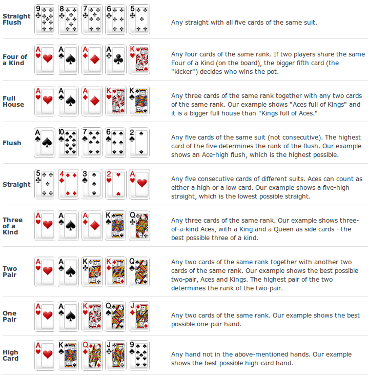

# About Me

__Matthieu Tanguay-Carel__

[matthieutc.com](http://matthieutc.com)

[@matstc](http://twitter.com/matstc)

# The Goal

- Pairing
- Test driving
- Refactoring

# The Format

We have a deck of features to implement:

1. A pair starts off on the first feature
2. We switch one member of the pair every X minutes
3. Go back to step 2

# Kata

Given a list of poker hands, figure out what they are worth and figure out the winner.

See [original kata](http://codingdojo.org/cgi-bin/wiki.pl?KataTexasHoldEm).

## Example Input / Output

Given this:

    Kc 9s Ks Kd 9d 3c 6d
    9c Ah Ks Kd 9d 3c 6d
    Ac Qc Ks Kd 9d 3c 
    9h 5s 
    4d 2d Ks Kd 9d 3c 6d
    7s Ts Ks Kd 9d 

Your program should output this:

    Kc 9s Ks Kd 9d 3c 6d Full House (winner)
    9c Ah Ks Kd 9d 3c 6d Two Pair
    Ac Qc Ks Kd 9d 3c Pair
    9h 5s High Card
    4d 2d Ks Kd 9d 3c 6d Flush
    7s Ts Ks Kd 9d Pair

## Poker Hand Rankings

